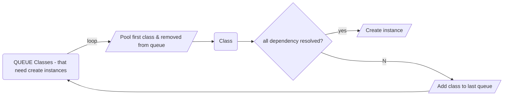

# Build Dependency Injection

Using Java Reflection

## Overview

- Scanning Classes
- Mapping Classes
- Create Service Instances
- Dependency Container

## 1. Scanning Classes

- Need separate two case: when run .jar file (compiled), and when run source code on IDE (classes)
- Import:
    - java.util.jar.JarFile
    - java.io.File

## 2. Mapping Classes

- Using Java Annotation to mark "`Service/Bean`"

```java

@Retention(RetentionPolicy.RUNTIME)
@Target(ElementType.METHOD)
public @interface Bean {
}
```

```java

@Retention(RetentionPolicy.RUNTIME)
@Target(ElementType.TYPE)
public @interface Service {
}
```

```java

@Retention(RetentionPolicy.RUNTIME)
@Target({ElementType.CONSTRUCTOR, ElementType.FIELD})
public @interface Autowired {
}
```

- Create `ScanningConfiguration` to define `declared annotation`, that need process
- Filter `declared annotation` from list classes (the result of step (1))

## 3. Create Service Instances

### ServicesInstantiation

- Initially, the list "dependency" does not need to be ordered



- With this algorithm, the class that has zero dependencies will be created instance first. The class that has max dependency will
  be created last

### ObjectInstantiationService

- List method
    - createInstance:
        - newInstance
        - setAutowiredFieldInstances
        - invokePostConstruct
    - createBeanInstance
    - destroyInstance: before set instance is null, need check instance has `preDestroy` method? (check method
      present `@PreDestoy` annotation), if yes, need invoke this method.

## 4. Dependency Container

- List method
    - init
    - getService : for `runStartUpMethod`
    - getServicesByAnnotation
    - getAllServices
    - getNewInstance(Class<?> serviceType, String instanceName)
        - `instanceName` like as `Qualifier` in Spring Bean
        - need separate case `Bean` vs `Service`
    - getServiceDetails
        - if `Scope=PROTOTYPE`

- run StartUp Method  (method has annotation `@StartUp`)
    - get serviceDetail from dependency container
    - find method present `@StartUp` annotation and returnType is `void`
    - using `java.lang.reflect.Method#invoke` to invoke it

## Source code
- [Source code](https://github.com/tungtv202/DependencyInjectionExample.git)
