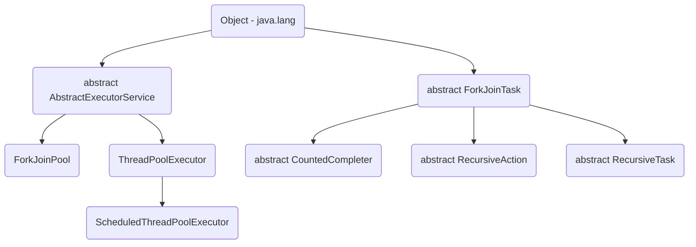

## ThreadLocal

- Mechanism is each thread has a "memory zone/separate". All methods of all classes/instances, if running in the same
  thread can access that "memory zone".

- Example case: create the context for the application. (ApplicationContext.getCurrentSession). It is very flexible.
  Replace for a way to get value via a parameter of the method (that has a bit lengthy. IMO).

- Improve thread-safe
- WARNING: Be careful when using it with ThreadPool. A situation may happen Task A and Task B, both running in the same
  thread (support by ThreadPool). Then TaskA can get the value that makes by TaskB.

- Some reference:
    - [http://drunkkid2000.blogspot.com](http://drunkkid2000.blogspot.com/2013/07/thread-local_2564.html)
    - [jenkov](http://tutorials.jenkov.com/java-concurrency/threadlocal.html)

### Code example

- `InheritableThreadLocal`:
    - Using it when you want to ChildThread (created by ParentThread) can using "clone copy" from ParentThread. (When
      ChildThread modify the value - NO modified the ParentThread)
    - The different ChildThread does not share the same "memory zone".

```java
public static void main(String[] args) {

        ThreadLocal<String> threadLocal = new ThreadLocal<>();
        InheritableThreadLocal<String> inheritableThreadLocal =
                new InheritableThreadLocal<>();

        Thread thread1 = new Thread(() -> {
            System.out.println("===== Thread 1 =====");
            threadLocal.set("Thread 1 - ThreadLocal");
            inheritableThreadLocal.set("Thread 1 - InheritableThreadLocal");

            System.out.println(threadLocal.get());
            System.out.println(inheritableThreadLocal.get());

            Thread childThread = new Thread(() -> {
                System.out.println("===== ChildThread =====");
                System.out.println(threadLocal.get());
                System.out.println(inheritableThreadLocal.get());
                inheritableThreadLocal.set("TUNG");
                System.out.println(inheritableThreadLocal.get());
            });

            Thread childThread2 = new Thread(() -> {
                try {
                    TimeUnit.SECONDS.sleep(3);
                } catch (InterruptedException e) {
                    e.printStackTrace();
                }
                System.out.println("===== ChildThread2 =====");
                System.out.println(threadLocal.get());
                System.out.println("Check: " + inheritableThreadLocal.get());
            });
            childThread.start();
            childThread2.start();

            try {
                TimeUnit.SECONDS.sleep(1);
            } catch (InterruptedException e) {
                e.printStackTrace();
            }
            System.out.println(inheritableThreadLocal.get());
            inheritableThreadLocal.set("TUNG2");
        });

        thread1.start();

//        Thread thread2 = new Thread(() -> {
//            try {
//                Thread.sleep(3000);
//            } catch (InterruptedException e) {
//                e.printStackTrace();
//            }
//
//            System.out.println("===== Thread2 =====");
//            System.out.println(threadLocal.get());
//            System.out.println(inheritableThreadLocal.get());
//        });
//        thread2.start();
    }
```

## Volatile

- Volatile helps the variable will get read/write from the main memory. (Default, maybe it can read/write from CPU
  Cache, that designed for performance, that is a reason for threads read/write not the latest value)


## ThreadSafe

### XSync

- This is a library that supports threadsafe, threads will wait for each other for using the same resource. (It will be helpful more `synchronization` tag)

```xml
        <dependency>
            <groupId>com.antkorwin</groupId>
            <artifactId>xsync</artifactId>
            <version>1.1</version>
        </dependency>
```

```java
// method
public void timeWaitLimit(String storeAlias) {
        xSync.execute(storeAlias, () -> {
            LeakyBucketModel model = BucketLeakyStatic.get(storeAlias);
            if (model == null) {
                log.debug(storeAlias + "-init");
                BucketLeakyStatic.put(storeAlias, new LeakyBucketModel(bucketSize));
            } else {
                log.debug(storeAlias + "-" + model.getAllowCounter() + "/" + bucketSize);
                if (model.getAllowCounter() <= 0) {
                    try {
                        TimeUnit.MILLISECONDS.sleep(1200);
                    } catch (InterruptedException e) {
                        e.printStackTrace();
                    }
                    int diffSecond = (int) TimeUnit.SECONDS.convert(Util.getUTC().getTime() - model.getModifiedTime(), TimeUnit.MILLISECONDS);
                    int reNewCounter = Math.min(diffSecond * drainRate, bucketSize);
                    model.reInitCounter(reNewCounter);
                }
                model.decrementCounter();
            }
        });
    }

// LeakyBucketModel.class
public class LeakyBucketModel {
    private int allowCounter;
    private long modifiedTime;

    public LeakyBucketModel(int allowCounter) {
        this.allowCounter = allowCounter;
        this.modifiedTime = Util.getUTC().getTime();
    }

    public void decrementCounter() {
        this.allowCounter -= 1;
        this.modifiedTime = Util.getUTC().getTime();
    }

    public void reInitCounter(int allowCounter) {
        this.allowCounter = allowCounter;
        this.modifiedTime = Util.getUTC().getTime();
    }

    public int getAllowCounter() {
        return this.allowCounter;
    }
    public long getModifiedTime() {
        return this.modifiedTime;
    }
}

```

## CompletableFuture

### Example: API for calculating the shipping-delivery fee

```java
 private GHNV2CalFeeDetailResponse calculator(int storeId, GHNV2CalculatorFeeRequest request) {
        String token = getToken(storeId);
        var clientResponse = client.calculatorFee(token, request);
        try {
            log.debug("--- calculator fee request --Token=" + token +
                    ", " + json.writeValueAsString(request) + "\n --- response " + json.writeValueAsString(clientResponse));
        } catch (Exception ignored) {
        }
        if (clientResponse == null || clientResponse.getCode() != 200) return null;
        var result = mapper.toDetailResponse(clientResponse);
        result.setRequest(request);
        return result;
    }

    private CompletableFuture<GHNV2CalFeeDetailResponse> calculatorFeeAsync(int storeId, GHNV2CalculatorFeeRequest request) {
        return CompletableFuture.supplyAsync(() -> calculator(storeId, request));
    }

    public List<GHNV2CalFeeDetailResponse> calculatorFee(int storeId, List<GHNV2CalculatorFeeRequest> requests) {
        if (CollectionUtils.isEmpty(requests)) return null;
        List<CompletableFuture<GHNV2CalFeeDetailResponse>> listAsync = new ArrayList<>();
        requests.forEach(e -> {
            listAsync.add(calculatorFeeAsync(storeId, e));
        });
        CompletableFuture<Void> allAsync = CompletableFuture
                .allOf(listAsync.toArray(new CompletableFuture[listAsync.size()]));

        CompletableFuture<List<GHNV2CalFeeDetailResponse>> allClientAsync = allAsync.thenApply(v -> listAsync.stream().map(CompletableFuture::join)
                .collect(Collectors.toList()))
                .handle((voidResult, throwable) ->
                        (throwable == null ?
                                listAsync.stream() :
                                listAsync.stream().filter(f -> !f.isCompletedExceptionally()))
                                .map(CompletableFuture::join)
                                .filter(Objects::nonNull)
                                .collect(Collectors.toList()));

        List<GHNV2CalFeeDetailResponse> result = new ArrayList<>();
        try {
            var temp = allClientAsync.get();
            if (!CollectionUtils.isEmpty(allClientAsync.get())) {
                result = temp;
            }
        } catch (InterruptedException | ExecutionException e) {
            throw new RuntimeException(e);
        }
        return result;
    }
```

## Striped Locks

Get an idea from each instance we need one Lock, so 1000 instances, you need 1000 Lock -> This is spent more memory.

The mechanism of StripedLock (Guava) is managed by the group. One Lock managed N element => Example: instances 1-100
using 1 Lock, instances 101-200 using 1 Lock => So, 1000 instances we just spent 10 Lock. This is the balancing between
performance and memory.

```java
private Striped<Lock> stripedLocks = Striped.lock(10);
public void update(Bag bag){
    Lock lock = stripedLocks.get(bag.getId());
    lock.lock();
    if (!bag.hasBlueCandy()){
        bag.add(new Candy(color"blue"));
    }
    lock.unlock();
}
```

- Many locks = More memory, good throughput
- Fewer locks = Better memory, more contention
- Striped locks = Middle ground
- Imp: Choose obj to retrieve the lock
- Need to have hashcode & equals
- Striped versions of Lock, Semaphore and ReadWriteLock
- Guava also has corresponding weak versions for easy GC

## ReadWriteLock

- `java.util.concurrent.locks.ReentrantLock` is the one implementation of Lock interface. This class has a structural
  method called `ReentrantLock(boolean fair)`. While if `fair` is true, threads will access with FIFO sequence.
- `ReadWriteLock` using two keys for the lock. One for `read` and one for `write`. Read key can acquire by many thread
  in the same time, while Write key can acquire by only one thread at the same time.

## Lock vs synchronized

- Synchronized blocks must be contained within a single method. lock.lock() and lock.unlock() can be called from
  different method
- lock.lock() and lock.unlock() provides the same visibility and happens before guarantees as entering and exiting a
  synchronized block
- Synchronized blocks are always reentrant, Lock could decide not to be
- Synchronized blocks do not guarantee fairness. Lock can
  (fairness is the happened when one thread keeps a waiting status forever, it can not access the object, that is
  locked. The reason is other threads always have higher priority. Not guarantee the FIFO)
- Example: `ReentrantLock`, when initial, we can set `fair` parameter is true

```java
 ReentrantLock lock = new ReentrantLock(true);
```

## Blocking Threads is Expensive

- Entering a synchronized block is not that expensive - if the thread is allowed access. But if the thread is blocked
  because another thread is already executing inside the synchronized block - the blocking of the thread is expensive.
  

## Threads Evaluation

(update 18/08/2021)

Number of threads <= (Number of cores) / [1 - Blocking Factor (BF)]

- Blocking Factor is the fraction of time a thread is blocked on IO operations
- If your tasks are computation-intensive, BF is 0 and # of Thread <= # of Cores
- If your tasks are IO intensive, and if BF is 0.9, # of Thread <= 10 * # of Cores
- If your tasks are IO intensive, and if BF is 0.5, # of Thread <= 2 * # of Cores
- Normally the maximum number of requests that you can handle concurrently <=10k (2k, 4k, 5k)

## ForkJoinPool



- `Work Stealing`:

```
Result solve(Problem problem) {
    if (problem is small)
        directly solve problem
    else {
        split problem into independent parts
        fork new subtasks to solve each part
        join all subtasks
        compose result from subresults
    }
}
```

- `ExecutorService::newFixedThreadPool(int nThreads)`: Creates a thread pool that reuses a fixed number of threads
  operating off a shared unbounded queue.
- `ScheduledExecutorService::newScheduledThreadPool(int corePoolSize)`: Creates a thread pool that can schedule commands
  to run after a given delay, or to execute periodically.
- `ExecutorService::newCachedThreadPool(ThreadFactory threadFactory)`: Creates a thread pool that creates new threads as
  needed, but will reuse previously constructed threads when they are available, and uses the provided ThreadFactory to
  create new threads when needed
- `ExecutorService::newWorkStealingPool(int parallelism)`: Creates a thread pool that maintains enough threads to
  support the given parallelism level, and may use multiple queues to reduce contention.

### Some use cases

1. If you want to process all submitted tasks in order of arrival, just use newFixedThreadPool(1)
2. If you want to optimize performance of big computation of recursive tasks, use ForkJoinPool or newWorkStealingPool
3. If you want to execute some tasks periodically or at certain time in the future, use newScheduledThreadPool

## Notify vs notifyAll ?
If you are not sure which to use, then use notifyAll