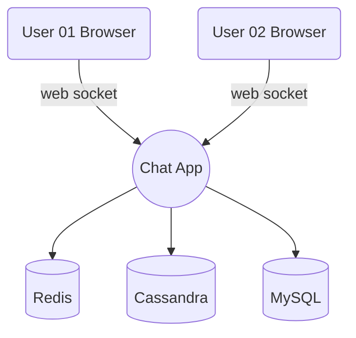
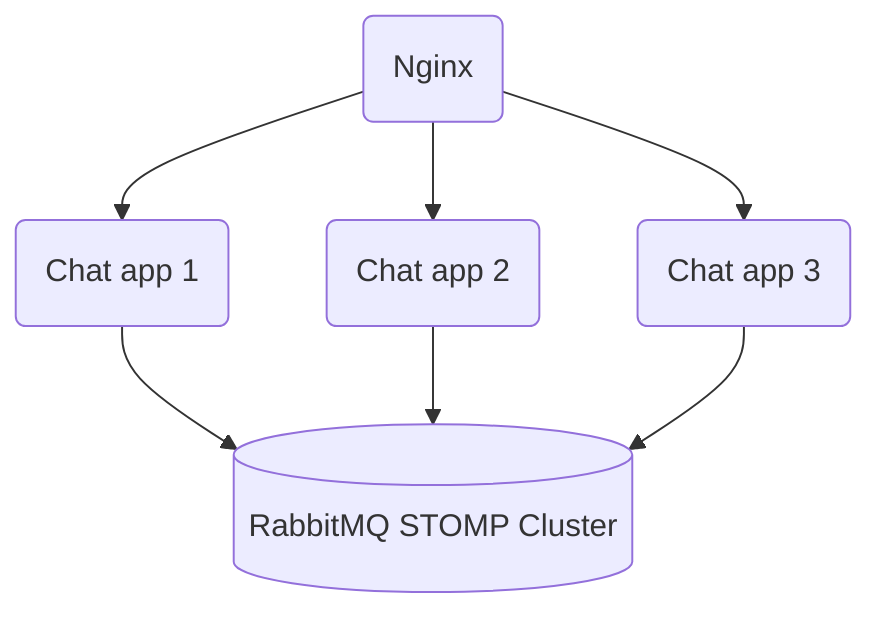
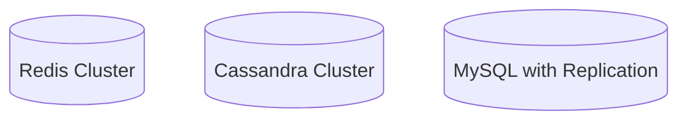

# Java chat app - use Cassandra, MySQL, Redis, RabbitMQ

Book: [Pro Java Clustering and Scalability - Building Real-Time Apps with Spring, Cassandra, Redis, WebSocket and RabbitMQ](https://www.apress.com/gp/book/9781484229842?utm_campaign=3_pier05_product_page&utm_content=11232017&utm_medium=referral&utm_source=safari&wt_mc=ThirdParty.Safari.3.EPR653.ProductPagePurchase#otherversion=9781484229859)

## Single node

- MySQL: store user/ user role
- Redis: store chatroom info (Redis Hash)
- Cassandra: store chat message conversation

### Flow

- after the WebSocket connected
- client asks for the connected users and their old messages
- client subscribes to start receiving
  - updates when a user joins or leaves the chat room
  - when a public message is sent
  - when a user receives a private message

## Multinode

1. Problem

- ClientA connect to server 1
- ClientB connect to server 2
- How clientA can connect to clientB?

2. Solution

- Using RabbitMQ as a full external STOMP Broker
- Using the Sticky Session Strategy
  - implementation group: 'org.springframework.session', name: 'spring-session'
  - spring.session.store-type: redis

## Code by features

### Private Messages

- Spring will auto transformed to destination
- Example
  - Private dest = `/queue/AG1XX5.private.messages`
  - When send message to user: user123, The destination will be transformed
    into `/queue/AG1XX5.private.messages-user123`
    `org.springframework.messaging.simp.SimpMessagingTemplate#convertAndSendToUser`
